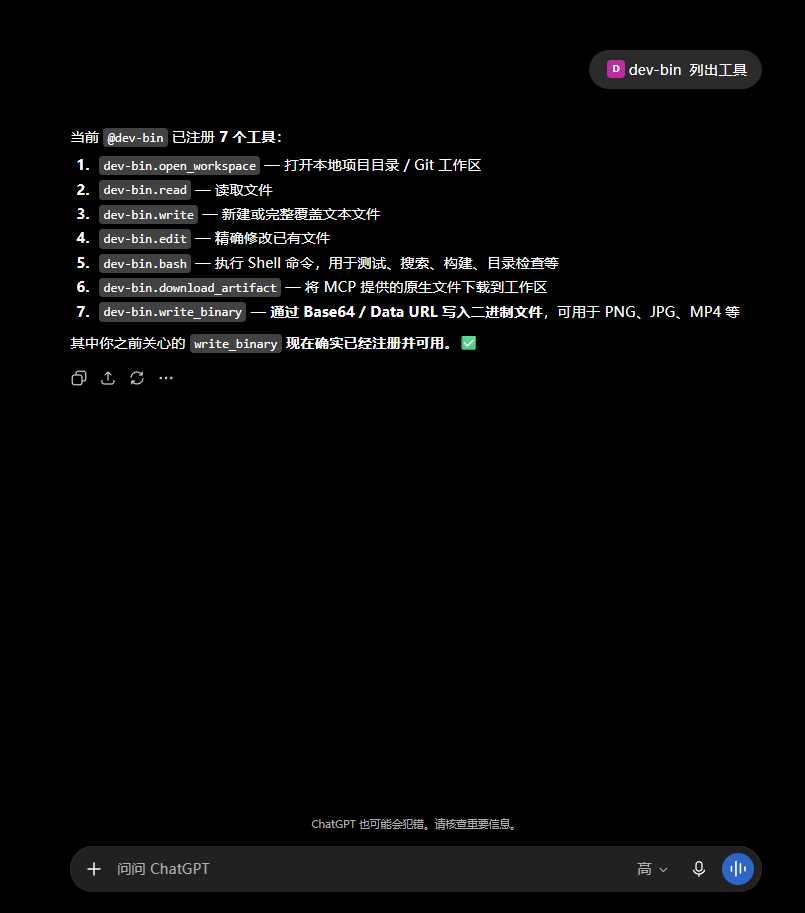
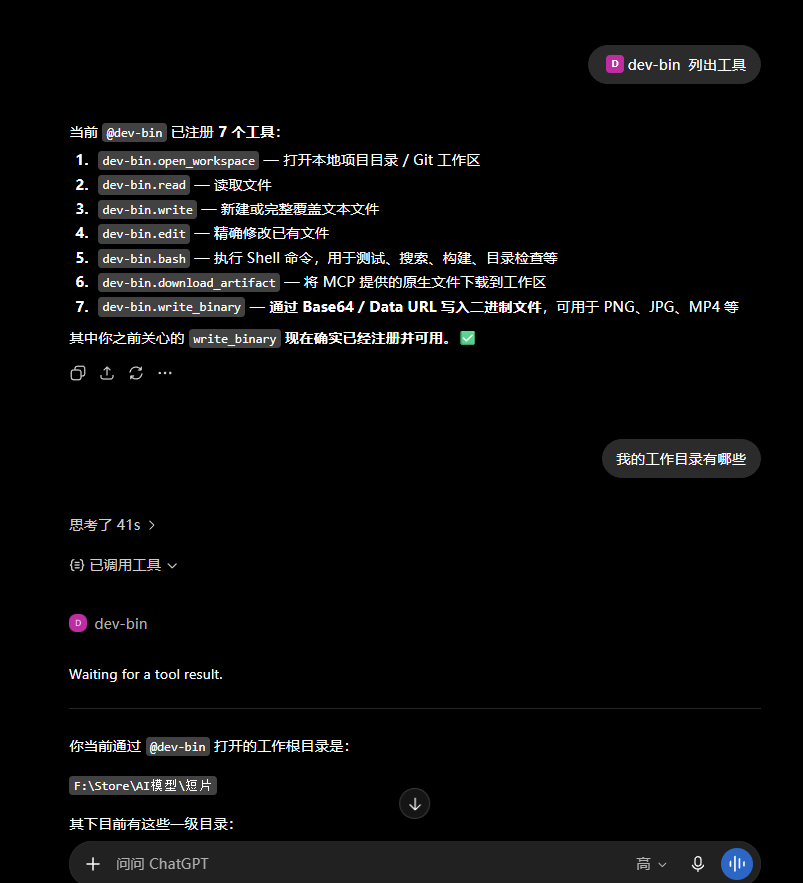

# DevSpace Local Artifacts

DevSpace Local Artifacts is a self-hosted MCP server for operating on approved
local workspaces from ChatGPT, Claude, or another MCP-capable host. This
release keeps the server local and adds guarded binary-artifact support for
Windows plus a Base64 fallback for hosts that cannot send native file
parameters.

## What this release adds

- `download_artifact` on Linux and Windows, with traversal, overwrite,
  symlink/junction, size, and publication-integrity checks.
- `write_binary` for strict Base64 strings and Base64 data URLs (maximum 32 MiB
  per inline payload).
- bounded MCP JSON parsing so oversized binary requests fail with a clear
  response instead of consuming unbounded memory.
- focused artifact, server-order, file-tool, performance, typecheck, and build
  checks.

## 与上游 `Waishnav/devspace` v1.0.5 的差异

Word 和 PDF 并不是被工具排除的格式。上游版本和本定制版都会把文件作为
二进制字节保存，不会转换或编辑文档内容；真正的差异在于平台支持和文件输入方式：

- 上游 v1.0.5 的 `download_artifact` 仅在 Linux 注册，Windows 上不能通过原生
  MCP 文件对象保存附件。
- 本定制版将 `download_artifact` 扩展到 Linux 和 Windows，并保留工作区边界、
  路径穿越、覆盖、符号链接/ junction、大小和发布完整性检查。因此，在 Windows
  上可以保存 MCP 主机提供的 `.pdf`、`.docx` 等文件。
- 本定制版新增 `write_binary`，当 MCP 主机不能传递原生文件对象时，可用完整的
  Base64 字符串或 `data:*;base64` URL 写入二进制文件；单个内联负载上限为 32 MiB。

保存 Word/PDF 的前提是设置 `DEVSPACE_ARTIFACTS=1`、先调用 `open_workspace`，并
使用工作区内新的相对路径。`download_artifact` 不接受任意下载 URL，也不会读取浏览器
下载目录；如果聊天客户端没有把附件作为原生文件传给 MCP，这属于客户端能力限制，
应改用 `write_binary` 或客户端支持的文件适配器。服务只负责保存字节，不负责生成、
解析或编辑 Word/PDF 内容。

## Requirements

- Node.js `>=22.19 <27`
- npm and Git
- Bash on Windows (Git Bash, WSL, MSYS2, or Cygwin)
- ngrok CLI only when a remote MCP host must reach the local server

The complete Node dependency graph is committed in `package-lock.json`.
`better-sqlite3` is a native dependency and `node-pty` is optional.

## Install from GitHub

```powershell
git clone https://github.com/cooky-dance/devspace-local-artifacts.git
Set-Location devspace-local-artifacts
npm ci
npm run build
npm install -g .
```

The global install exposes the `devspace` command. To work from the checkout,
use `npm run dev` instead.

## 中文使用指南：安装后会不会自动运行？

不会。`npm install -g .` 只安装命令，不会注册 Windows 服务、计划任务，
也不会自动启动 ngrok。DevSpace 和 ngrok 是两个需要分别运行的前台进程。

DevSpace 自身有一个方便的首次启动行为：

- `devspace`（不带参数）和 `devspace serve` 都会先检查配置；在可交互的终端
  中，如果尚未配置，会自动进入初始化向导，然后启动服务器。
- 在非交互终端中不会自动提问，而是报错并提示先运行 `devspace init`，或提供
  `DEVSPACE_OAUTH_OWNER_TOKEN` 与 `DEVSPACE_ALLOWED_ROOTS`。
- `devspace init` 会询问允许访问的本地根目录、监听端口和公网基础 URL，并创建：
  `%USERPROFILE%\.devspace\config.json` 与
  `%USERPROFILE%\.devspace\auth.json`。如果设置了 `DEVSPACE_CONFIG_DIR`，实际位置
  以该目录为准。
- `devspace serve` 在当前终端前台运行；按 `Ctrl+C` 会停止它。ngrok 必须在另一个
  终端单独运行。

因此，安装完成后并不会“开机自启”。如果确实需要开机启动，可以自行用 Windows
任务计划程序或一个受保护的 PowerShell 启动脚本注册两个进程；项目本身不会替你
创建任务，也不要把 ngrok 令牌或 Owner password 写进脚本。

### Windows 推荐启动顺序（端口 3003 示例）

下面的 `3003` 只是示例；你也可以使用默认的 `7676`，但 DevSpace 监听端口和
ngrok 目标端口必须完全一致。

一次性安装和初始化：

```powershell
npm install -g .
.\scripts\install-ngrok.ps1
ngrok config add-authtoken <YOUR_NGROK_TOKEN>

$env:PORT = "3003"
$env:DEVSPACE_ARTIFACTS = "1"
devspace init
```

初始化时，公网基础 URL 只填 origin，例如
`https://your-tunnel-host.example.com`，不要填 `/mcp`。如果此时还没有固定的
ngrok 地址，可以先填本机 origin，等隧道启动后在启动服务器时用环境变量覆盖。
临时隧道在 DevSpace 尚未启动时可能先显示 502；只要它和 DevSpace 最终指向同一
端口，服务器启动后 502 就会消失：

```powershell
# 终端 2：先启动隧道并记下输出的域名；此时后端尚未启动，短暂 502 是正常的
ngrok http 3003

# 终端 1：把 <YOUR_NGROK_DOMAIN> 换成上一步输出的域名
$env:PORT = "3003"
$env:DEVSPACE_ARTIFACTS = "1"
$env:DEVSPACE_PUBLIC_BASE_URL = "https://<YOUR_NGROK_DOMAIN>"
devspace serve
```

如果 ngrok 每次生成的新域名不同，必须同步更新
`DEVSPACE_PUBLIC_BASE_URL` 并重启 DevSpace；否则 Host allowlist 和 OAuth resource
仍然指向旧地址。服务器启动后可用
`http://127.0.0.1:3003/healthz` 检查本地是否返回 HTTP 200。

远程 MCP 客户端使用的地址永远是公网 origin 加 `/mcp`：
`https://<YOUR_NGROK_DOMAIN>/mcp`。同一台电脑上的本地客户端可以直接访问
`http://127.0.0.1:3003/mcp`，不需要公网隧道。

## 本地运行方式（不使用公网隧道）

如果 MCP 客户端/Agent 就运行在同一台 Windows 电脑上，可以只启动 DevSpace，
不启动 ngrok。此时客户端使用：

```text
http://127.0.0.1:3003/mcp
```

### 使用全局安装的 `devspace` 命令

在 PowerShell 中运行：

```powershell
$env:PORT = "3003"
$env:DEVSPACE_ARTIFACTS = "1"
devspace init
```

首次初始化时，允许访问的根目录只选择确实需要给 Agent 使用的文件夹；公网基础
URL 可以填写：

```text
http://127.0.0.1:3003
```

初始化完成后，在同一个终端启动服务：

```powershell
$env:PORT = "3003"
$env:DEVSPACE_ARTIFACTS = "1"
devspace serve
```

看到 `devspace listening on http://127.0.0.1:3003/mcp` 后，另开一个 PowerShell
检查服务：

```powershell
Invoke-WebRequest -UseBasicParsing http://127.0.0.1:3003/healthz
devspace doctor
```

健康检查返回 HTTP 200 后，把 `http://127.0.0.1:3003/mcp` 填入同机 MCP 客户端。
服务会在当前窗口前台运行，停止时按 `Ctrl+C`。本地客户端能连接时不需要 ngrok，
但 ChatGPT 网页端这类云端客户端仍然需要公网 HTTPS 隧道。

### 从源码目录运行

如果你想修改 DevSpace 本身，直接在源码目录运行：

```powershell
Set-Location C:\path\to\devspace-local-artifacts
npm ci
npm run build

$env:PORT = "3003"
$env:DEVSPACE_ARTIFACTS = "1"
npm run dev
```

`npm run dev` 会监视 `src` 目录，代码变化或进程崩溃后自动重启服务器。首次运行
前仍然需要先执行一次 `devspace init`；如果当前目录没有全局命令，可以用已构建
的 CLI 初始化：

```powershell
node dist/cli.js init
```

更稳妥的方式是从已经完成全局安装的终端执行 `devspace init`，因为初始化文件默认
保存在当前 Windows 用户的 `%USERPROFILE%\.devspace` 下。

## ChatGPT 网页端：添加自定义 MCP

ChatGPT 的菜单名称会随网页版本变化，通常位于 Settings → Apps/Connectors →
Create custom app（或类似的“自定义连接器”入口）。连接流程如下：

1. 先确认 DevSpace 和 ngrok 都在运行，并且本地 `/healthz` 返回 200。
2. 在自定义 MCP/Connector 的连接地址中填写完整端点：
   `https://<YOUR_NGROK_DOMAIN>/mcp`。
3. 高级设置中的 OAuth Client ID/Secret 如果标为可选，可以留空，让客户端使用
   DevSpace 的动态注册；不要把 Owner password 填进 Client ID 或 Secret。若客户端
   明确要求固定 Client ID/Secret，应使用该客户端自己生成的值，不要伪造 DevSpace
   的值。
4. 点击下一步后，浏览器会跳转到 DevSpace 的 “Connect DevSpace”/登录授权页。
   这里输入的是 **Owner password**，不是 ngrok 令牌，也不是 ChatGPT 密码。
5. 授权成功后回到 ChatGPT，在聊天中启用这个自定义应用即可。服务器重启、隧道
   域名变化或 OAuth 会话过期后，如果界面显示“已禁用”或“重新连接”，先确认两
   个进程和地址无误，再点击“重新连接”刷新授权和工具列表。

## 连接成功后的使用方式：在聊天中 Add plugin

连接器创建并完成 Owner password 授权后，日常使用不需要再次填写 MCP 地址。建议
在 **普通聊天模式** 中打开一个对话，点击输入框附近的 **Add plugin/添加插件**
（不同版本可能显示为“添加应用”“Apps”或“工具”），选择 DevSpace，然后直接在
聊天框描述任务。

这样做的重点是：**添加插件本身不会把整个本地工作区预先塞进对话，也不会因为
连接插件本身消耗 context 额度**。只有真正调用工具后返回的文件内容、差异或命令
输出会进入当前对话上下文；一次要求读取超大文件、整个目录或大量图片，仍可能按
ChatGPT 当前规则占用上下文。因此，先让 DevSpace `open_workspace`，再按任务读取
必要文件，通常最省上下文。

### 可直接复制的使用案例

#### 1. 只检查项目，不修改文件

在聊天模式中添加 DevSpace 后发送：

```text
请使用 DevSpace 打开 C:\Projects\my-app。
先只检查根目录、README.md 和 package.json，告诉我项目用途和可运行的测试命令；
不要修改任何文件，也不要读取 .env、密钥或凭据文件。
```

#### 2. 修改代码并验证

```text
请在当前已打开的 DevSpace 工作区中修复登录页面的这个错误：<描述错误>。
先读取相关文件并说明计划，再做最小修改；修改后运行相关测试，最后列出改动文件、
测试结果和仍需我确认的事项。
```

#### 3. 将当前聊天中的一张图片保存到本地

启用 `DEVSPACE_ARTIFACTS=1` 后，可以发送：

```text
请使用 DevSpace 把我刚刚发送的图片保存到当前工作区
public/images/generated-001.png。
先调用 open_workspace；如果这是聊天提供的原生图片附件，使用 download_artifact；
目标文件已存在时不要覆盖，改用新的文件名。完成后只返回工作区相对路径、文件大小
和校验结果。
```

#### 4. 逐张保存当前对话中可用的多张图片

```text
请把当前对话中所有可下载的图片逐张保存到
public/images/chat-history/，按 generated-001.png、generated-002.png 的顺序命名。
每保存一张就确认一次；不要覆盖已有文件，也不要把远程 URL 当成本地文件下载。
如果某张图片不是可用的原生附件，请列出它的编号并暂停，不要猜测图片地址。
```

图片保存的实际调用链是 `open_workspace` → `download_artifact` → 普通 `read/write/edit`
工具。若客户端无法提供原生附件，才使用 `write_binary` 和完整 Base64 数据；DevSpace
不会接受任意粘贴的下载 URL，也不会读取聊天平台之外的图片。

### 使用时的几个小习惯

- 每个新聊天先确认工具栏中已经选中了 DevSpace；如果没有，点击 **Add plugin/添加插件**
  后再发送任务，不必重新创建连接器。
- 让模型先打开一个明确的工作区，再读取必要文件；不要一上来要求“读取整个项目”。
- 保存图片时使用新的相对路径，避免覆盖已有文件；完成后让模型返回路径和大小，方便
  在资源管理器中核对。
- 如果网页显示插件被禁用或“重新连接”，先恢复 DevSpace/ngrok，再点击重新连接；
  不要在聊天中反复粘贴 Owner password。

### 操作截图

第一张实际操作图如下：ChatGPT 普通聊天模式中，`dev-bin` 插件已经列出 7 个工具，
其中包含 `download_artifact` 和 `write_binary`，说明图片文件写入能力已启用。



第二张实际操作图如下：在聊天模式中询问“我的工作目录有哪些”，DevSpace 调用
`open_workspace` 并返回已打开的本地工作区。



仍待补充：

3. 图片保存成功后返回本地相对路径的结果。

### Owner password 在哪里？

`devspace init` 完成时会在终端显示 `Owner password: ...`，并显示保存路径。默认
文件是：

```text
C:\Users\<你的用户名>\.devspace\auth.json
```

其中 JSON 字段名是 `ownerToken`。可以只在自己的电脑上查看：

```powershell
Get-Content "$env:USERPROFILE\.devspace\auth.json"
```

不要把这个文件、终端截图、密码或令牌提交到 Git、发到聊天中或粘贴到第三方
网站。`“未授权创建”` 只表示创建连接器时不要求预先批准；DevSpace 运行时仍然
要求在授权页输入 Owner password。忘记密码时，先从当前 `auth.json` 取值；如果要
轮换密码，应先备份文件，再显式设置新的
`DEVSPACE_OAUTH_OWNER_TOKEN` 并保持后续启动也使用同一值，然后让所有客户端重新
连接。不要通过关闭 OAuth 来绕过认证。

## Gemini 或其他自定义插件：连接方式

在 Gemini 的“设置自定义的关联应用”（或对应的自定义 MCP/插件页面）中：

| 输入项 | 填写内容 |
| --- | --- |
| MCP 连接地址 | `https://<YOUR_NGROK_DOMAIN>/mcp`，必须包含 `/mcp` |
| OAuth Client ID/Secret | 如果界面允许为空就留空；若强制要求，使用 Gemini 生成的客户端值 |
| 登录/批准密码 | DevSpace 的 Owner password（见上节） |

点击“下一步”后按跳转页面完成 Owner password 授权，再回到 Gemini 启用该关联
应用。不要把 `https://<YOUR_NGROK_DOMAIN>`（不带 `/mcp`）直接当作 MCP 端点，
也不要把 `http://127.0.0.1:3003/mcp` 填到云端 Gemini；云端只能访问公网 HTTPS
地址。如果 Gemini 报“redirect_uri 不允许”或类似错误，查看错误中显示的回调域名，
把它加入允许列表后重启 DevSpace（保留默认值）：

```powershell
$env:DEVSPACE_OAUTH_ALLOWED_REDIRECT_HOSTS = "chatgpt.com,localhost,127.0.0.1,<GEMINI_REDIRECT_HOST>"
devspace serve
```

`<GEMINI_REDIRECT_HOST>` 必须替换为 Gemini 实际使用的 hostname，不要凭猜测填写
第三方域名。

## 结合实际使用遇到的错误

- **ngrok 502 Bad Gateway**：通常表示隧道目标端口没有服务，或端口不一致。比如
  DevSpace 监听 `3003` 时必须运行 `ngrok http 3003`，不能指向 `3030`；先检查
  `http://127.0.0.1:3003/healthz`，再检查 ngrok 命令。
- **401、Owner password 不接受**：说明 OAuth 授权没有完成，或者输入的不是当前
  `auth.json` 中的 `ownerToken`。完成授权后回到客户端并重新连接。
- **网页端显示连接被禁用/出现“重新连接”**：常见于服务器重启、隧道域名变化或
  会话过期。确认 `DEVSPACE_PUBLIC_BASE_URL` 与当前 ngrok origin 一致、端点带
  `/mcp`，然后点击重新连接；只有在进程本身停止或端口改变时才需要重启两项服务。
- **找不到 `devspace` 命令**：说明 npm 全局 bin 目录没有在当前 PowerShell 的
  `PATH` 中。重新打开终端，或改用项目目录中的 `npm run dev`/`npx` 命令验证安装。

## Install and configure ngrok

On Windows, run the bundled installer:

```powershell
.\scripts\install-ngrok.ps1
```

It uses the official Winget package `ngrok.ngrok` when ngrok is not already on
`PATH`. Token configuration is intentionally separate and interactive:

```powershell
ngrok config add-authtoken <YOUR_NGROK_TOKEN>
```

ngrok 需要先注册账号并在 Dashboard 获取 AuthToken；免费计划会自动分配一个
`*.ngrok-free.app` 开发域名。运行 `ngrok http 3003` 后，终端会显示本次隧道的
公网 HTTPS origin，不需要另外购买或注册域名。免费计划不能自定义域名；如需固定的
自定义域名，应使用支持该功能的付费计划。

The token, `ngrok.yml`, OAuth password, local paths, and tunnel URL are runtime
data and must not be committed.

## Start DevSpace and the tunnel

Initialize once and choose only the local roots that the MCP host may open. The
initialization prompt stores the public origin without `/mcp`:

```powershell
$env:PORT = "3003"
$env:DEVSPACE_ARTIFACTS = "1"
devspace init
```

Start the tunnel and note its HTTPS origin. A temporary tunnel may show 502
until the local server is listening:

```powershell
ngrok http 3003
```

Start the server in a second terminal, targeting the same port and, when the
tunnel URL is not already persisted, overriding the public origin:

```powershell
$env:PORT = "3003"
$env:DEVSPACE_ARTIFACTS = "1"
$env:DEVSPACE_PUBLIC_BASE_URL = "https://<YOUR_NGROK_DOMAIN>"
devspace serve
```

The MCP client endpoint is that origin plus `/mcp`. A public tunnel is not
required when the MCP client runs on the same machine.

## Artifact workflow

1. Call `open_workspace` for an approved project directory.
2. For a host-provided native file, call `download_artifact` with the returned
   `workspaceId` and an unused relative destination such as
   `public/images/generated.png`.
3. If the host cannot provide a native file, call `write_binary` with a complete
   Base64 string or `data:image/png;base64,...` URL.

Both tools refuse absolute paths, traversal, existing destinations, and unsafe
parent directories. The feature is opt-in; keep `DEVSPACE_ARTIFACTS` unset or
`0` when binary writes are not needed.

## Verification

```powershell
npm run typecheck
npm test
npm run build
npm pack --dry-run
```

See [docs/dependencies.md](docs/dependencies.md),
[docs/setup.md](docs/setup.md), [docs/configuration.md](docs/configuration.md),
[docs/artifact-exchange.md](docs/artifact-exchange.md), and
[docs/security.md](docs/security.md) for detailed setup and safety boundaries.

## 也可以让 Agent 教你使用

如果不想手动记这些命令，可以把项目链接直接粘贴给你使用的 Agent，并发送类似
下面的请求：

```text
请先阅读这个 DevSpace 项目的 README，告诉我在 Windows 上如何本地安装、初始化、
启动 MCP 服务，并说明 ChatGPT 网页端、普通聊天模式 Add plugin 和本地 MCP 客户端
分别应该填什么地址。请只给出步骤和命令，不要读取、输出或保存我的 auth.json、
Owner password、ngrok 令牌、Cookie 或其他凭据。
```

当前这份带本地文件写入说明的版本：

```text
https://github.com/cooky-dance/devspace-local-artifacts
```

上游原项目：

```text
https://github.com/Waishnav/devspace
```

本仓库的 Windows 文件写入、Word/PDF 保存差异和本文档中的定制说明以本 README 为准。无论使用哪个 Agent，都不要把
`%USERPROFILE%\.devspace\auth.json` 的内容粘贴给它。

## 上游归属与许可证

本仓库是基于 [Waishnav/devspace](https://github.com/Waishnav/devspace) v1.0.5 的
公开定制版，不是上游官方发行版，也不代表上游作者背书。上游的 MIT 版权声明和许可
文本保留在 [LICENSE](LICENSE) 中；发布包含上游代码的副本或衍生版本时，请一并保留
该文件，并另外核对依赖项各自的许可证。

## License

MIT. See [LICENSE](LICENSE).
